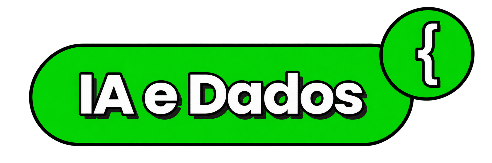
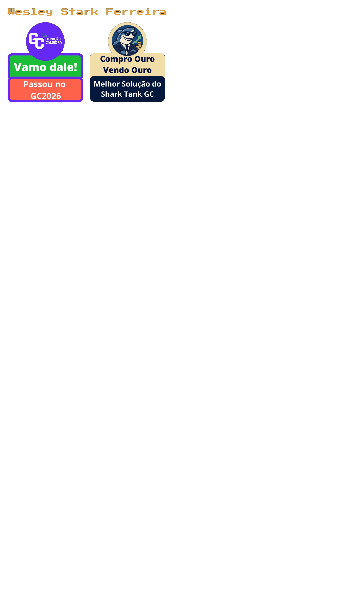

  

---
## Conquistas
 

---
## -  Conquistas
Progressão: Ganhe conquistas ao ter presença e participação das aulas, completar exercicios e desafios. 

Recompensas: Conquistas alem de serem lindas, podem ser usadas como vantagem no projeto final. 

## - Cursos que Valem Conquistas :trophy:

Além da presença, participação nas aulas e desafios, você pode ganhar **conquistas especiais** ao concluir cursos online recomendados.  

Esses cursos não só vão turbinar seus conhecimentos, mas também vão render **badges exclusivas** que podem ser usadas como vantagem no projeto final.  

:point_right: Faça o curso, conclua todas as etapas e mostre o certificado no Discord para garantir sua conquista.  

### Cursos Disponíveis:
- [💡 Trilha TIC em Trilhas - Análise de dados com Python](https://ticemtrilhas.org.br/trail/2fbdc1e1-2877-4d28-ad73-db456a7e7238)  
